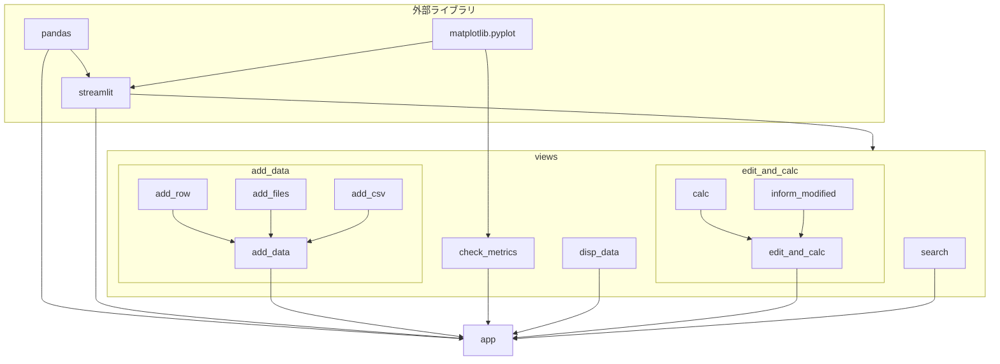
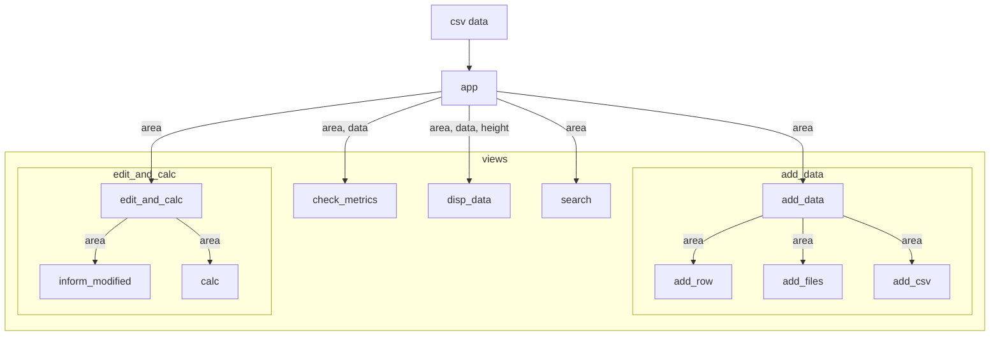

## ライブラリと関数の依存関係

```mermaid
graph TD;


subgraph ex[外部ライブラリ]
    pd["pandas"]
    st["streamlit"]
    plt["matplotlib.pyplot "]
end

subgraph views
    add_data
    check_metrics
    disp_data
    edit_and_calc
    search
end

subgraph add_data[add_data]
    add_data_func[add_data]
    add_row
    add_files
    add_csv
    
    add_row-->add_data_func;
    add_files-->add_data_func;
    add_csv-->add_data_func;
end

subgraph edit_and_calc[edit_and_calc]
    edit_and_calc_func[edit_and_calc]
    inform_modified
    calc
    
    calc-->edit_and_calc_func;
    inform_modified-->edit_and_calc_func;
end


pd---->app;
st---->app;
add_data_func-->app;
check_metrics-->app;
disp_data-->app;
edit_and_calc_func-->app;
search-->app;

st-->views;
plt-->check_metrics;
pd-->st;
plt-->st;

```

## データの流れ

```mermaid
graph TD;


subgraph views
    add_data
    check_metrics
    disp_data
    edit_and_calc
    search
end

subgraph add_data[add_data]
    add_data_func[add_data]
    add_row
    add_files
    add_csv

    add_data_func--area-->add_row;
    add_data_func--area-->add_files;
    add_data_func--area-->add_csv;
end

subgraph edit_and_calc[edit_and_calc]
    edit_and_calc_func[edit_and_calc]
    inform_modified
    calc
    
    edit_and_calc_func--area-->calc;
    edit_and_calc_func--area-->inform_modified;
end


db[csv data]-->app;
app--area-->add_data_func;
app--area, data-->check_metrics;
app--area, data, height-->disp_data;
app--area-->edit_and_calc_func;
app--area-->search;


```
